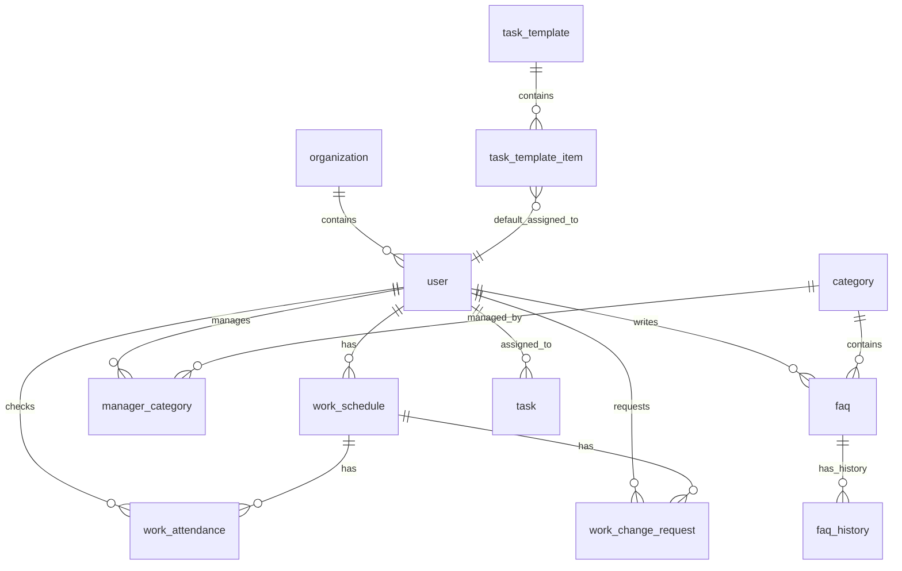

# CommuteMate Database Schema

## Overview
CommuteMate 백엔드 시스템의 데이터베이스 스키마 문서입니다.

## ERD
전체 ERD: [Link to ERD](https://dbdiagram.io/d/ku_ict-68db5736d2b621e422822757)

---

## 1. Code System (공통 코드)

### 1.1 `code_major`
코드 대분류 (예: WS, CR, CS, CT, TT, RL)

### 1.2 `code_sub`
코드 소분류 (예: 01, 02...)

### 1.3 `code`
코드 마스터 테이블. 시스템 전반에서 상태, 유형, 역할 등을 정의하는데 사용됩니다.
- **Full Code**: `WS01`, `RL02` 등

---

## 2. User & Organization

### 2.1 `organization`
- 조직 정보를 저장합니다.

### 2.2 `user`
- 사용자 정보를 저장합니다.
- `role_code`: 사용자 역할 (CodeType: RL01-학생, RL02-관리자, RL03-매니저 등)
- `organization_id`: 소속 조직

### 2.3 `manager_category`
- 매니저(`user`)와 담당 분류(`category`) 간의 매핑 테이블입니다.

### 2.4 `email_verification_code`
- 회원가입 시 이메일 인증을 위한 임시 코드를 저장합니다.
- 5분의 유효기간을 가집니다.

---

## 3. Work Schedule & Attendance

### 3.1 `work_schedule`
- 근무 일정 테이블입니다.
- `start_time`, `end_time`: 근무 시간
- `status_code`: 일정 상태 (WS01:신청, WS02:승인, WS03:반려, WS04:취소)
- `is_deleted`: 소프트 삭제 플래그

### 3.2 `monthly_schedule_config`
- 월별 스케줄 설정 정보입니다.
- `max_concurrent`: 해당 월의 시간대별 최대 근무 가능 인원
- `apply_start/end_time`: 근무 신청 가능 기간

### 3.3 `work_attendance`
- 실제 출퇴근 기록입니다.
- `check_time`: 체크 시간
- `check_type_code`: 체크 유형 (CT01:출근, CT02:퇴근)
- `verified`: QR 검증 여부

### 3.4 `work_change_request`
- 근무 일정 변경/취소 요청입니다.
- `type_code`: 요청 유형 (CR01:수정, CR02:삭제)
- `status_code`: 처리 상태 (CS01:대기, CS02:승인, CS03:거절)

---

## 4. FAQ System

### 4.1 `category`
- FAQ 분류입니다.
- `favorite`: 즐겨찾기 여부

### 4.3 `faq`
- FAQ 게시글 본문입니다.
- `deleted_flag`: 소프트 삭제 플래그

### 4.4 `faq_history`
- FAQ 수정 이력(Audit Log)입니다. 수정 전 데이터를 보관합니다.

---

## 5. Task System

### 5.1 `task`
- 일일 업무 테이블입니다.
- `task_date`, `task_time`: 업무 수행 일시
- `task_type`: 업무 유형 (TT01:일반, TT02:기타 등)
- `is_completed`: 완료 여부

### 5.2 `task_template`
- 정기 업무 템플릿입니다.
- `template_name`, `description`: 템플릿 정보
- `is_active`: 사용 여부

### 5.3 `task_template_item`
- 템플릿 상세 항목입니다.
- `title`: 업무 제목
- `task_time`: 예정 시간
- `default_assignee_id`: 기본 담당자
- `display_order`: 정렬 순서

---

## Entity Relationships Summary

